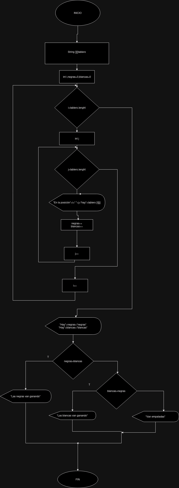

# Examen 1ª Evaluación

---

Explica a continación cada apartado del examen

Con cada apartado realiza un commit diferente
**Me olvidé en el diagrama poner un if para comprobar si es negra o blanca y contarlas**


**Se declararía el array de string**

- **Declaración del array**:
  ```java
    /**
  * Creado el tablero de damas.
  *
  * @version 1.0
  * @autor Daniel Figueroa Vidal
    */
  
  
  
  public class Damas {
    public static void main(String[] args) {
        String[][] tablero = {
            {null, "negras", null, "negras", null, "negras", null, "negras"},
            {"negras", null, "negras", null, "negras", null, "negras", null},
            {null, "negras", null, "negras", null, "negras", null, "negras"},
            {null, null, null, null, null, null, null, null},
            {null, null, null, null, null, null, null, null},
            {"blancas", null, "blancas", null, "blancas", null, "blancas", null},
            {null, "blancas", null, "blancas", null, "blancas", null, "blancas"},
            {"blancas", null, "blancas", null, "blancas", null, "blancas", null},
        };
    }
  }
  ```
- **Primera funcion**:
  ```java
  /**
   * Recorrer tablero.
   * Mostraremos por pantalla el tablero
   *
   * @param tablero[][].
   */

  ```
  **No está implementado igual que en el diagrama de flujo, aquí habría dos bucles similares, en la primera funcion solamente se recorrería el array mostrandolo por pantalla 
  y en la segunda funcion se recorrería para contar las damas**
- **Segunda funcion**:
  ```java
  /**
   * Recorrer tablero para contar cuantas blancas y cuantas negras hay en el tablero.
   *
   * @param tablero[][].
   */

  ```
  **La tercera funcion estaría dentro de la segunda, la segunda le pasaría los parametros.**
- **Tercera funcion**:
  ```java
  /**
   * Comprobar si las quien va ganando, o si van empates. Retornando un string con el que va ganando
   *
   * @param blancas, negras.
   * @return ganador
   */

  ```